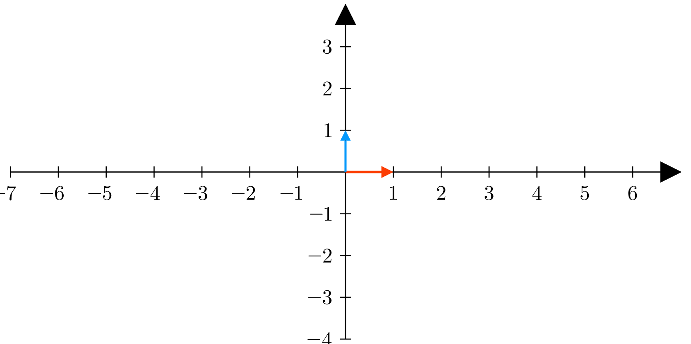

# Week 5
## Array
An array is a collection of values stored in consecutive memory locations. In c++, arrays are quite complex with the array name as being the pointer pointing to the address of the 1st element in that array. And dealing with address of 2D array is a whole new world. Python is very different from C/C++ and abstracts away many low-level computational details, allowing the programmer to focus more on what to do rather than how to do it. This power of python will be very visible as we study arrays in Python.

## Lists
An array (Collection of values) is called a list in Python. List can store multiple values.
```
[2, 5, 6]
```
There's no need to specify the datatype, the size of a list. And lists are expandable as much as needed.
Not only that but a python list can hold different datatypes.
```
[0.2, "This is a string inside a list", 3, [65, "List inside the list"], True]
```
Indexing in list is done the same way as done in c++ arrays i.e. the 1st element has index 0 and so on.
```
[0.2, "This is a string inside a list", 3, [65, "List inside the list"], True][1]
```
would return the string `"This is a string inside a list"`.

## Function
A function is a set of code which in normal execution is ignored until the function is explicitly called.
```
def func(x):
    return x*x
```
Function is declared with the keyword `def`, followed by the function name, and function arguments inside of the brackets. No-where the datatype (return datatype) of function can be seen. Same goes for the argument(s), there is no datatype. This is very different from C/C++. A function can be called:
```
func(3)
```
`9` is returned by the function. `func` also accepts floating point values.
```
func(4.5)
```
`20.25`
is returned by the function.
Everything is super cool until a situation like:
```
func("3")
```
happens. Since there is no datatype, the function `func` is super happy to accept `"3"`. The function gives no problem and the program goes on. After that function statement `x*x` is executed. Since the `*` operator cannot operate on two strings, the program will come to a stop and return an error message.

## Function Arguments DataTypes
It is very important to check that the data received by the function is valid for the uncoming python statements. Forexample, in the above case, it should be make sured that `x` is either an `int` or `float` and not a `str` or `bool`. Let's see how that can be done:
```
def func(x):
    if isinstance(x, int) or isinstance(x, float):
        pass
    else:
        raise Exception(f"{x} is {type(x)}. Whereas it should be either int or float")

    return x*x
```
4 new statements are added. These statement check the datatype of the received argument to see if it is suitable for the upcoming statements. Please read `isinstance()` function online. In case anything else than `int` or `float` is passed, `else` block gets executed. `raise Exception()` writes the string to `stderr` and the program stops, no next statement is executed.
```
func("4")
```
The above call will write the following error message on the terminal
```
Traceback (most recent call last):
  File "/home/muhammad/test.py", line 9, in <module>
    func("4")
  File "/home/muhammad/test.py", line 5, in func
    raise Exception(f"{x} is {type(x)}. Whereas it should be either int or float")
Exception: 4 is <class 'str'>. Whereas it should be either int or float
```
Although, it doesn't seem like but this output is in stderr and not in stdout.
> Enjoyable Task: How can you verify that all of this is indeed written in stderr and not stdout.

## Vector Addition Function
### Vector
In Math terms, a vector is a Matrix with only 1-column.
### Vectors representation in Computer
Vectors can be represented by an array (list) in computers. Therefore,
$$
\text{The vector}
\\;
\begin{bmatrix}
3 \\\\
5 \\\\
7 \\\\
2 \\\\
\end{bmatrix}
\\;
\text{Translates to}
\\;
[3, 5, 7, 2]
$$

### Vector Addition Function Arguments
Two vectors are going to be accepted as function arguments i.e. vector1 and vector2.
```
def add_2_vectors(vec1, vec2):
```
Once the two vectors are accepted as function arguments, the actual code which is responsible for adding the two vectors can be written.
```
temp = [None for i in range(len(vec1))]
for i in range(len(vec1)):
    temp[i] = vec1[i] + vec2[i]
return temp
```
> Enjoyable Task: Can you run these three statements in one single python statement?

Now the function is completely functional, can be called and passed two vectors to be added.
```
v1 = [7, 6, 9]
v2 = [4, 6, 3]
add_2_vectors(v1, v2)
```
When the function is called with two valid lists, it works wonderfully well and add those two vectors. But!
```
v1 = 2
v2 = [2, 6]
add_2_vectors(v1, v2)
```
The function was supposed to add two vectors/lists together, not an integer and a vector. So this running this block of code will return an error.
```
Traceback (most recent call last):
  File "/home/muhammad/IntroToPython/week5/vector_addition.py", line 25, in <module>
    print(add_2_vectors(3, [2, 3]))
          ^^^^^^^^^^^^^^^^^^^^^^^^
  File "/home/muhammad/IntroToPython/week5/vector_addition.py", line 20, in add_2_vectors
    temp = [None for i in range(len(vec1))]
                                ^^^^^^^^^
TypeError: object of type 'int' has no len()
```
Now pause and ponder. Think about the error given. The error is describing the functionality failure of python statements. A logical error saying the function `len` cannot be operated on `int`.
Sourcing out a function like this will make the lives of other developers very hard. They may need to spend hours and hours to study the functionality (The programming logics) of the function before finally understanding what is causing the error. So what can we do to avoid these hours of work of other developers.

### Error Message
The task to do is caught any invalid data received in the arguments and give a very clear message. So that other developers quickly understand without deeply studying the function's functionality. There are three check points for this specific function.
- vec1 and vec2 both are lists.
- Elements of vec1 and vec2 are either integers or floating point values.
- Len of vec1 and vec2 are same.
The 1st two check points are of computational nature. While the 3rd one is of Math nature. That means function is gonna fail, if the 1st two check points are not met. While the function may or may not work if the 3rd point is not met (This will be demonstrated later in the document).
## STDERR and Exception
Before starting to code the checkpoints. Two very important concepts must be discussed. The 1st is standard error stream. As we have studied before `print()` function writes to standard ouput. Data received in standard output stream are considered valid program results i.e. in case the process is successful, the results will be written to stdout. Then from stdout any other program can read it. Or the results of stdout can also be redirected to a `FILE`. Consider the command `ls`. When `ls` is executed, a process is created which requests the Operating System to give it list of contents in the specified directory. What we see in the output is the results of `ls` command. These results are sent to stdout.
```
muhammad@debian:~$ ls -l IntroToPython/
total 28
-rw-r--r-- 1 muhammad muhammad 1071 Apr  7 13:10  LICENSE
-rw-r--r-- 1 muhammad muhammad   15 Apr  7 13:10  README.md
drwxr-xr-x 2 muhammad muhammad 4096 May 13 01:02  week1
drwxr-xr-x 2 muhammad muhammad 4096 Apr 28 20:51  week2
drwxr-xr-x 2 muhammad muhammad 4096 Apr 28 21:02 'week2&3'
drwxr-xr-x 2 muhammad muhammad 4096 Apr 28 21:02  week4
drwxr-xr-x 2 muhammad muhammad 4096 May 13 01:28  week5
```
Now I can pass these results to another command/c program (which again will turn into a process) and try to filter out week5 details only.
```
muhammad@debian:~$ ls -l IntroToPython/ | grep week5
drwxr-xr-x 2 muhammad muhammad 4096 May 13 01:28 week5
```
The pipe symbol `|` passes the results (data received in standard output stream) of `ls` to standard input of `grep` which than filters out week5 details. Note: pipe `|` will cause the results of ls to go to stdin of `grep` (not appearing on the screen). The output we see `drwxr-xr-x 2 muhammad muhammad 4096 May 13 01:28 week5` is the standard ouput of `grep` and not `ls`.
But consider a situation where `ls` command/program fails.
```
muhammad@debian:~$ ls -l IntroToPython5/ 
ls: cannot access 'IntroToPython5/': No such file or directory
```
In this case, what we see on the screen is received in standard error stream and not standard output stream. In this case, pipe will not pass the `ls: cannot access 'IntroToPython5/': No such file or directory` string to whatever command/program follows the pipe symbol.
```
muhammad@debian:~$ ls -l IntroToPython5/ | grep week5
ls: cannot access 'IntroToPython5/': No such file or directory
```
It is very clearly seen that there is no string as `week5` in the output, then why did grep wrote it. It was not actually grep who wrote the string in the standard output stream. It was `ls` which wrote the string `ls: cannot access 'IntroToPython5/': No such file or directory` to standard error stream of the terminal. And pipe `|` did not pass the error stream data to `grep`. Therefore grep never receive something to grep out of.
## Check Points
### 1st Check Point
Make sure the vec1 and vec2 both are lists.
```
if isinstance(vec, list):
    pass
else:
    raise Exception(f"{vec} is of type {type(vec)}. Whereas it must be a list.")
```
`isinstance(vec, list)` function returns `True` in case the 1st argument is an instance of 2nd and `False` in case the 1st argument is not instance of 2nd. This block of code is making sure that both `vec1` and `vec2` are instances of `lists`. In case string, int, float, boolean, dictionary datatypes are passed to the function, the program stops immediately raising the Exception. Let's see how
```
def add_2_vectors(vec1, vec2):
    for vec in [vec1, vec2]:
        if isinstance(vec, list):
            pass
        else:
            raise Exception(f"{vec} is of type {type(vec)}. Whereas it must be a list.")
```
In case user passes an integer and a list.
```
add_2_vectors(2, [3,4,6])
```
The program immediately caughts the error and raises the exception.
```
Traceback (most recent call last):
  File "/home/muhammad/IntroToPython/week5/vector_addition.py", line 25, in <module>
    print(add_2_vectors(3, [2, 3]))
          ^^^^^^^^^^^^^^^^^^^^^^^^
  File "/home/muhammad/IntroToPython/week5/vector_addition.py", line 6, in add_2_vectors
    raise Exception(f"{vec} is of type {type(vec)}. Whereas it must be a list.")
Exception: 3 is of type <class 'int'>. Whereas it must be a list.
```
Now the error message says that passed integer 3 is an `int`, whereas it must be a list.
| Python Error Message | Our defined Error Message |
|----------------------|---------------------------|
| TypeError: object of type 'int' has no len() | Exception: 3 is of type <class 'int'>. Whereas it must be a list. |
Closely examine the two error messages. The 1st one is telling about the functionality failure of python statements, while the other one is clearly saying function cannot accept an integer as argument. The reader will quickly understand I need to pass a list in place of the integer for the function to function properly. It is not practical for someone to study a 1000 lines of function's code to finally understand what has gone wrong. I hope the purpose of user defined error message is clear to you.
### 2nd Check Point
Once it has been cleared out both `vec1` and `vec2` are instances of list, we can move on to check the next possible unvalid data values that can be received in arugments. The 2nd is to check the datatype of each individual elements of `vec1` and `vec2`, making sure elements are either integer or float and nothing else.
```
for i in vec:
    if isinstance(i, int) or isinstance(i, float):
        pass
    else:
        raise Exception(f"{i} is of type {type(i)}. Whereas it must be either an integer or a floats.")
```
In case user passes some weird value in the lists, we also caught it and give the user a very clear error message.
```
def add_2_vectors(vec1, vec2):
    for vec in [vec1, vec2]:
        if isinstance(vec, list):
            pass
        else:
            raise Exception(f"{vec} is of type {type(vec)}. Whereas it must be a list.")
    
    for i in vec:
        if isinstance(i, int) or isinstance(i, float):
            pass
        else:
            raise Exception(f"The list {vec} contains element {i} which is of type {type(i)}. Whereas it must be either an integer or a floating point value.")
```
In case user passes values like
```
add_2_vectors([4, 6, "3"], [2, 5, 1])
```
The program caughts the error message and gives out a very clear error message.
```
Traceback (most recent call last):
  File "/home/muhammad/IntroToPython/week5/vector_addition.py", line 25, in <module>
    add_2_vectors([4, 6, "3"], [2, 5, 1])
  File "/home/muhammad/IntroToPython/week5/vector_addition.py", line 13, in add_2_vectors
    raise Exception(f"The list {vec} contains element {i} which is of type {type(i)}. Whereas it must be either an integer or a floating point value.")
Exception: The list [4, 6, '3'] contains element 3 which is of type <class 'str'>. Whereas it must be either an integer or a floating point value.
```
The error message is telling the errored list and also which element is causing the error and also what is the solution.
| Python Error Message | Our defined Error Message |
|----------------------|---------------------------|
| TypeError: can only concatenate str (not "int") to str | Exception: The list [4, 6, '3'] contains element 3 which is of type <class 'str'>. Whereas it must be either an integer or a floating point value. |
Notice the difference between two error messages.
Not only there is a clear error message but there is also a very huge issue we resolved here.
Consider the following case
```
v1 = [random.randint(0, 100) for i in range(100000000)]
v2 = [random.randint(0, 100) for i in range(99999999)]
v2.append("3")
add_2_vectors(v1,v2)
```
`v1` contains 100 million random integers while `v2` contains 99 million random integers and on last contains a string `"3"`. So the function starts and will successfuly add 99 million integers.The 100 million position of `v1` contains a random integer but the same position of `v2` contains string `"3"`. And since integer and string cannot be added to one another. The program causes an error.

Time consumed without 2nd Check Point.
```
muhammad@debian:~/IntroToPython/week5$ time python3 vector_addition.py 
Traceback (most recent call last):
  File "/home/muhammad/IntroToPython/week5/vector_addition.py", line 29, in <module>
    add_2_vectors(v1,v2)
  File "/home/muhammad/IntroToPython/week5/vector_addition.py", line 23, in add_2_vectors
    temp[i] = vec1[i] + vec2[i]
              ~~~~~~~~^~~~~~~~~
TypeError: unsupported operand type(s) for +: 'int' and 'str'

real    1m22.780s
user    1m22.137s
sys     0m0.313s
```
Time consumed with 2nd CheckPoint.
```
muhammad@debian:~/IntroToPython/week5$ time python3 vector_addition.py 
Traceback (most recent call last):
  File "/home/muhammad/IntroToPython/week5/vector_addition.py", line 29, in <module>
    add_2_vectors(v1,v2)
  File "/home/muhammad/IntroToPython/week5/vector_addition.py", line 14, in add_2_vectors
    raise Exception(f"The list contains element {i} which is of type {type(i)}. Whereas it must be either an integer or a floating point value.")
Exception: The list contains element 3 which is of type <class 'str'>. Whereas it must be either an integer or a floating point value.

real    1m21.641s
user    1m21.330s
sys     0m0.229s
```

Without adding the check point took more time than with checkpoint. Now the difference b/w the two times may not look significant because the time taken to check if element is integer or float by two functions `isinstance(x, int)` and `isinstance(x, float)` and then combining the returned two booleans using `or` operator takes the same time as adding two integers. But the thing is, you will always not be just adding integers. Much more complex operations are performed on vectors and matrices.
Remove the `isinstance(x, float)` function and the `or` operator and the time reduces to 1m16.801s
```
muhammad@debian:~/IntroToPython/week5$ time python3 vector_addition.py 
Traceback (most recent call last):
  File "/home/muhammad/IntroToPython/week5/vector_addition.py", line 29, in <module>
    add_2_vectors(v1,v2)
  File "/home/muhammad/IntroToPython/week5/vector_addition.py", line 14, in add_2_vectors
    raise Exception(f"The list contains element {i} which is of type {type(i)}. Whereas it must be either an integer or a floating point value.")
Exception: The list contains element 3 which is of type <class 'str'>. Whereas it must be either an integer or a floating point value.

real    1m16.801s
user    1m16.628s
sys     0m0.167s
```

### 3rd Check Point
The last thing is more of Math thing than of computer thing. Because there can be cases where computer doesn't see that as a problem. The point is to check if the two vectors are equal in length or not. Obviously, two vectors with different number of rows cannot be added together in Math (in computer terminology).
```
if len(vec1) == len(vec2):
    pass
else:
    raise Exception("Length of both Vectors must be same.")
```
This block of code makes sure that both `vec1` and `vec2` have the same length.
```
temp = [None for i in range(len(vec1))]
for i in range(len(vec1)):
    temp[i] = vec1[i] + vec2[i]
return temp
```
#### Cases where computer doesn't see unequal vectors as a problem
As can be seen in the code that both `temp` list and the `for` loop depend on the length of `vec1`. So as long as `vec2` is greater than or equal to `vec1`, the code should work just fine. Because if `vec1` is greater, the loop tries to go beyond the limits of `vec2` and that causes an error.
```
add_2_vectors([4, 6, 3], [2, 5, 6, 7])
```
The above code causes no error. But the result returned is logically/Mathematically wrong.
$$
\begin{bmatrix}
4 \\\\
6 \\\\
3 \\\\
\end{bmatrix}
\\;
+
\\;
\begin{bmatrix}
2 \\\\
5 \\\\
6 \\\\
7 \\\\
\end{bmatrix}
\\;
\=
\\;
\begin{bmatrix}
6 \\\\
11 \\\\
9 \\\\
\end{bmatrix}
$$
Computer will add them as above. But it is a logical mistake. Since there are no errors. The program will generate very unexpected results and debugging those logical errors is terrible.

<div align="center"><u> Practice Questions </u></div>

> Write a function that takes adds, subtracts, multiplies, divides an integer from a vector. Function takes integer, vector and operation (as string `"+"`, `"-"`, `"*"`, "/") as arguments and returns the result.

> Write a function that takes adds, subtracts, multiplies, divides two vectors. Function takes vectors and operation (as string `"+"`, `"-"`, `"*"`, "/") as arguments and returns the result.

> Write a function that performs dot product on two vectors and returns the result. Should take two vectors as arguments.

> Write a function that performs cross product on two vectors and returns the result. Should take two vectors as arguments.

> Write a function that performs dot product on two vectors and returns the result. Should take two vectors as arguments.

> Write a function that gives the unit vector of the given vector. Should take vector as argument.

Hint: There are many functions using the same set of code forexample checkpoints. You may write a separate function who's just responsible for checking data.

<div align="center"><u> Advanced Practice Questions </u></div>

Consider the following Axes 